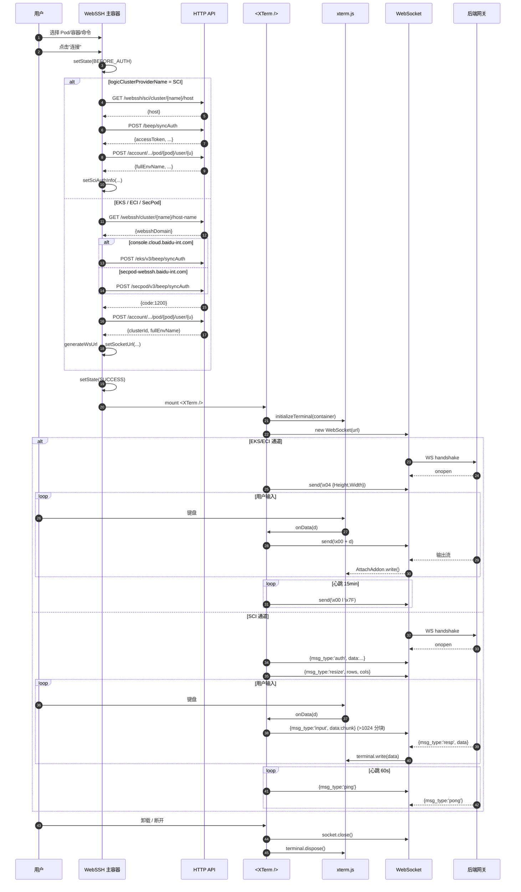

# WebSSH 连接终端 —— 完整复刻指南

本文档抽取自 `cnap1.0` 项目 `runtime/webssh` 路由下"连接终端"功能的完整实现。
按此文档，可以在任何 React 项目中复刻出：

- 基于 `xterm.js` 的终端渲染
- 两种后端通道：**EKS/ECI（二进制帧）** 和 **SCI（JSON 帧）**
- 认证 → 建连 → I/O → 心跳 → 断开 的完整生命周期
- 全屏、终端内搜索、自适应尺寸、加载遮罩

> 本文档中的代码来自实际生产实现，可直接复制使用，仅需按"依赖裁剪"章节替换少量业务耦合 API。

---

## 一、架构概览

```
┌──────────────────────────────────────────────────────────────┐
│                     WebSSH 主容器组件                          │
│  1. 选择环境/集群/Pod/容器/命令                                │
│  2. 判断集群类型（SCI vs EKS/ECI）                             │
│  3. 走对应认证链路                                             │
│  4. 认证成功后渲染 <XTerm />                                   │
└──────────────────────────────────────────────────────────────┘
                              │
                              ▼
┌──────────────────────────────────────────────────────────────┐
│                       <XTerm /> 组件                          │
│  1. initializeTerminal() —— 创建 xterm 实例 + addons          │
│  2. 分流：                                                    │
│      ├── sciAuthInfo → initializeSCIWebSocket()  (JSON 协议)  │
│      └── url         → initializeWebSocket()     (二进制协议) │
│  3. 全屏 / 搜索 / 自适应尺寸                                   │
│  4. 卸载时 socket.close() + terminal.dispose()                │
└──────────────────────────────────────────────────────────────┘
                              │
                              ▼
                         WebSocket 连接
                              │
              ┌───────────────┴───────────────┐
              ▼                               ▼
     EKS/ECI Exec Gateway               SCI SSH Gateway
     二进制帧 \x00/\x04                    JSON 消息
```

### 状态机

```
NO_CONNECTION ──点击连接──▶ BEFORE_AUTH ──认证中──▶ AUTHING ──成功──▶ SUCCESS
       ▲                        │                     │                │
       │                        └────────失败─────────┴────────────────┘
       │                                          │
       │                                          ▼
       └──────────点击断开───────────────────────  FAIL
```

---

## 二、依赖清单

在目标项目 `package.json` 中新增（版本来自源项目，验证过可用）：

```json
{
  "dependencies": {
    "xterm": "^4.13.0",
    "xterm-addon-attach": "^0.6.0",
    "xterm-addon-fit": "^0.5.0",
    "xterm-addon-search": "^0.8.0",
    "xterm-addon-unicode11": "^0.2.0",
    "xterm-addon-web-links": "^0.4.0",
    "react": "^18.2.0",
    "@emotion/styled": "^11.10.0",
    "antd": "^5.x",
    "@ant-design/icons": "^5.x"
  }
}
```

> `@panda-design/components` 是内部组件库，可用 `antd` 的 `Button` / `message` 直接替代。
> `huse` 提供 `useElementSize` / `useSwitch`，可用等价 hooks 手写替换（下文提供）。

---

## 三、目录结构建议

```
src/
├── components/
│   └── XTerm/
│       ├── index.tsx              # 终端 UI 容器
│       └── utils/
│           └── initialize.ts      # 核心：xterm + WebSocket 初始化
├── modules/
│   └── WebSSH/
│       ├── index.tsx              # 业务主容器（认证/流程编排）
│       ├── util.ts                # 状态枚举 + WebSocket URL 构造
│       └── ...                    # Filter / CommandType 等选择器
├── api/
│   ├── webssh.ts                  # Pod 认证、获取域名
│   ├── sciAuth.ts                 # SCI 集群认证
│   └── ...
├── interface/
│   └── entities/
│       └── webssh.ts              # SCIAuthInfo 类型
└── utils/
    └── createHeartBeatController.ts  # 心跳控制器
```

---

## 四、核心代码（可直接复制）

### 4.1 类型定义 `src/interface/entities/webssh.ts`

```ts
// SCI 集群认证信息（前端会把这个对象序列化成 auth 帧发给 SCI 网关）
export interface SCIAuthInfo {
    host: string; // SCI SSH 网关地址（不含协议）
    host_ip: string;
    namespace: string;
    pod: string;
    user: string;
    access_token: string;
    refresh_token: string;
    token_type: string;
    expires_in: string;
    container_id: string;
    is_log_pod: boolean;
    serviceName: string; // 业务标识，如 'CNAP'
    Command: string[]; // 如 ['/bin/sh'] 或 ['/bin/bash']
}
```

### 4.2 心跳控制器 `src/utils/createHeartBeatController.ts`

```ts
interface HeartBeatOptions {
    callback: () => void;
    minutes: number;
}

/**
 * 保持 socket 连接活跃：每分钟触发一次 callback，直到达到 minutes 上限。
 * restart() 用来在有交互时刷新计数（避免无谓的心跳）。
 */
export const createHeartBeatController = ({ callback, minutes }: HeartBeatOptions) => {
    let timer: any = null;
    let heartBeatCount = 0;

    const checkHeartbeat = () => {
        callback();
        if (heartBeatCount < minutes) {
            timer = setTimeout(checkHeartbeat, 60000);
            heartBeatCount++;
        }
    };

    const restart = () => {
        clearTimeout(timer);
        heartBeatCount = 0;
        checkHeartbeat();
    };

    const clear = () => {
        clearTimeout(timer);
    };

    return { restart, clear };
};
```

### 4.3 终端与 WebSocket 初始化 `src/components/XTerm/utils/initialize.ts`

这是整个功能的**核心文件**。

```ts
/* eslint-disable camelcase */
import type {SCIAuthInfo} from '@/interface/entities/webssh';
import {createHeartBeatController} from '@/utils/createHeartBeatController';
import {Terminal} from 'xterm';
import {AttachAddon} from 'xterm-addon-attach';
import {FitAddon} from 'xterm-addon-fit';
import {SearchAddon} from 'xterm-addon-search';
import {Unicode11Addon} from 'xterm-addon-unicode11';
import {WebLinksAddon} from 'xterm-addon-web-links';

export interface TerminalWidthAddon extends Terminal {
    fitAddon: FitAddon;
    searchAddon: SearchAddon;
}

// ─────────────────────────────────────────────────────────────
// 1. xterm 终端实例创建（协议无关）
// ─────────────────────────────────────────────────────────────
export const initializeTerminal = (pageContainer: HTMLDivElement): TerminalWidthAddon => {
    const terminal = new Terminal({
        cursorBlink: true,
        cursorStyle: 'block',
        scrollback: 800,
    });

    const fitAddon = new FitAddon();
    terminal.loadAddon(fitAddon);

    const unicode11Addon = new Unicode11Addon();
    terminal.loadAddon(unicode11Addon);
    terminal.unicode.activeVersion = '11';

    terminal.loadAddon(new WebLinksAddon());

    const searchAddon = new SearchAddon();
    terminal.loadAddon(searchAddon);

    terminal.open(pageContainer);
    fitAddon.fit();

    terminal.writeln('Welcome to WebSSH');
    terminal.writeln('Enjoy!');

    (terminal as TerminalWidthAddon).fitAddon = fitAddon;
    (terminal as TerminalWidthAddon).searchAddon = searchAddon;

    return terminal as TerminalWidthAddon;
};

export const disposeTerminal = (terminal: Terminal) => {
    terminal.dispose();
};

// ─────────────────────────────────────────────────────────────
// 2. EKS/ECI 通道（二进制帧协议）
//    - stdin: \x00 + data
//    - resize: \x04 + JSON({Height, Width})
//    - heartbeat: \x00l\x7F（15 分钟一次）
//    - 服务端 → 客户端：由 AttachAddon 自动写入 terminal
// ─────────────────────────────────────────────────────────────
interface WebSocketInit {
    url: string;
    onClose: () => void;
    onWork: () => void;
}

export const initializeWebSocket = (
    terminal: Terminal,
    { url, onClose, onWork }: WebSocketInit,
): WebSocket => {
    const socket = new WebSocket(url);
    let isOpened = false;

    const attachAddon = new AttachAddon(socket);
    terminal.loadAddon(attachAddon);

    // 收到的二进制数据统一按 ArrayBuffer 解析
    socket.binaryType = 'arraybuffer';
    const textEncoder = new TextEncoder();
    const { rows, cols } = terminal;

    const heartBeatController = createHeartBeatController({
        callback: () => socket.send(textEncoder.encode('\x00l\x7F')),
        minutes: 15,
    });

    // 终端尺寸变化 → 通过 4 号通道发送
    terminal.onResize(size => {
        const sizeMsg = { Height: size.rows, Width: size.cols };
        if (isOpened) {
            socket.send(textEncoder.encode(`\x04${JSON.stringify(sizeMsg)}`));
            heartBeatController.restart();
        }
    });

    // 用户输入 → 通过 0 号通道发送 stdin
    terminal.onData(data => {
        socket.send(textEncoder.encode(`\x00${data}`));
        heartBeatController.restart();
    });

    const handleClose = () => {
        heartBeatController.clear();
        isOpened = false;
        onClose && onClose();
    };

    socket.addEventListener('error', handleClose);
    socket.addEventListener('close', handleClose);

    socket.onopen = () => {
        isOpened = true;
        const sizeMsg = { Height: rows, Width: cols };
        onWork();
        socket.send(textEncoder.encode(`\x04${JSON.stringify(sizeMsg)}`));
        heartBeatController.restart();
    };

    return socket;
};

// ─────────────────────────────────────────────────────────────
// 3. SCI 通道（JSON 帧协议）
//    客户端 → 服务端：auth | resize | input | ping
//    服务端 → 客户端：resp | pong
//    - input 超过 1024 字节需分块
//    - 心跳每 60 秒一次（ping）
// ─────────────────────────────────────────────────────────────
type SCIMessageType = 'auth' | 'ping' | 'pong' | 'resize' | 'input' | 'resp';

interface SCIMessage {
    msg_type: SCIMessageType;
    data?: string;
    rows?: number;
    cols?: number;
}

const parseSCIMessage = async (data: MessageEvent['data']): Promise<SCIMessage> => {
    if (typeof data === 'string') {
        return JSON.parse(data);
    }
    if (data instanceof Blob) {
        return JSON.parse(await data.text());
    }
    if (data instanceof ArrayBuffer) {
        return JSON.parse(new TextDecoder().decode(data));
    }
    throw new Error('Unsupported SCI WebSocket message type');
};

interface SCIWebSocketInit {
    sciAuthInfo: SCIAuthInfo;
    onClose: () => void;
    onWork: () => void;
}

export const initializeSCIWebSocket = (
    terminal: Terminal,
    { sciAuthInfo, onClose, onWork }: SCIWebSocketInit,
): WebSocket => {
    const url = `ws://${sciAuthInfo.host}/api/ssh`;
    const socket = new WebSocket(url);
    let isOpened = false;
    let isAuthenticated = false;
    const { rows, cols } = terminal;

    const sendMessage = (message: SCIMessage) => {
        if (socket.readyState === WebSocket.OPEN) {
            socket.send(JSON.stringify(message));
        }
    };

    const heartBeatController = createHeartBeatController({
        callback: () => sendMessage({ msg_type: 'ping' }),
        minutes: 1,
    });

    terminal.onResize(size => {
        if (isOpened && isAuthenticated) {
            sendMessage({ msg_type: 'resize', rows: size.rows, cols: size.cols });
            heartBeatController.restart();
        }
    });

    terminal.onData(data => {
        if (!isAuthenticated) return;
        // >1024 字节分块发送，避免服务端拆包问题
        const maxChunkSize = 1024;
        for (let i = 0; i < data.length; i += maxChunkSize) {
            const chunk = data.slice(i, i + maxChunkSize);
            sendMessage({ msg_type: 'input', data: chunk });
        }
        heartBeatController.restart();
    });

    const handleClose = () => {
        heartBeatController.clear();
        isOpened = false;
        isAuthenticated = false;
        onClose && onClose();
    };

    socket.addEventListener('error', handleClose);
    socket.addEventListener('close', handleClose);

    socket.onmessage = async event => {
        try {
            const message = await parseSCIMessage(event.data);
            switch (message.msg_type) {
                case 'resp':
                    if (message.data) terminal.write(message.data);
                    break;
                case 'pong':
                    break; // 心跳响应，无需处理
                default:
                    break;
            }
        } catch (e) {
            console.error('Failed to parse SCI WebSocket message:', e);
        }
    };

    socket.onopen = () => {
        isOpened = true;
        // 1. 先发认证帧
        sendMessage({ msg_type: 'auth', data: JSON.stringify(sciAuthInfo) });
        // 2. 立即发一次尺寸
        sendMessage({ msg_type: 'resize', rows, cols });
        isAuthenticated = true;
        onWork();
        heartBeatController.restart();
    };

    return socket;
};
```

### 4.4 XTerm 容器组件 `src/components/XTerm/index.tsx`

```tsx
import {CSSProperties, useCallback, useEffect, useRef, useState} from 'react';
import 'xterm/css/xterm.css';
import type {SCIAuthInfo} from '@/interface/entities/webssh';
import {
    CloseOutlined,
    ColumnHeightOutlined,
    ColumnWidthOutlined,
    FullscreenExitOutlined,
    FullscreenOutlined,
    SearchOutlined,
} from '@ant-design/icons';
import styled from '@emotion/styled';
import {Button, Input, Tooltip} from 'antd';
import {
    disposeTerminal,
    initializeSCIWebSocket,
    initializeTerminal,
    initializeWebSocket,
    TerminalWidthAddon,
} from './utils/initialize';

// —— 全屏 API 兼容 —————————————
interface FullScreenDocument extends Document {
    mozFullScreenElement?: Element;
    webkitFullscreenElement?: Element;
    msFullscreenElement?: Element;
}
interface FullScreenElement extends HTMLElement {
    msRequestFullscreen?: () => Promise<void>;
    mozRequestFullScreen?: () => Promise<void>;
    webkitRequestFullscreen?: () => Promise<void>;
}

// —— 简版 useSwitch / useElementSize（替代 huse）——
const useSwitch = (initial: boolean) => {
    const [on, set] = useState(initial);
    return [on, useCallback(() => set(true), []), useCallback(() => set(false), [])] as const;
};

const useElementSize = () => {
    const ref = useRef<HTMLDivElement>(null);
    const [size, setSize] = useState<{ width: number; height: number; }>();
    useEffect(() => {
        if (!ref.current) return;
        const observer = new ResizeObserver(entries => {
            const { width, height } = entries[0].contentRect;
            setSize({ width, height });
        });
        observer.observe(ref.current);
        return () => observer.disconnect();
    }, []);
    return [ref, size] as const;
};

// —— 样式 —————————————
interface RootProps {
    isFullscreen?: boolean;
    isPageFullscreen?: boolean;
}
const Root = styled.div<RootProps>`
    width: 100%;
    position: relative;
    ${({ isFullscreen, isPageFullscreen }) =>
    (isFullscreen || isPageFullscreen) && `
        position: fixed;
        top: 0; left: 0; right: 0; bottom: 0;
        z-index: 1000;
        background: #000;
        padding: 20px;
    `}
`;
const Xterminal = styled.div<RootProps>`
    width: 100%;
    height: ${({ isFullscreen, isPageFullscreen }) => ((isFullscreen || isPageFullscreen) ? '100vh' : '100%')};
`;

const maskStyle: CSSProperties = {
    position: 'absolute',
    left: 0,
    right: 0,
    top: 0,
    bottom: 0,
    zIndex: 99,
    display: 'flex',
    alignItems: 'center',
    justifyContent: 'center',
    fontSize: 36,
    color: '#333',
    backgroundColor: 'rgba(255, 255, 255, .8)',
};
const toolButtonStyle: CSSProperties = {
    position: 'absolute',
    top: 20,
    zIndex: 1001,
    color: '#000',
    backgroundColor: '#fff',
};
const searchContainerStyle: CSSProperties = {
    position: 'absolute',
    right: 120,
    top: 20,
    zIndex: 1001,
    display: 'flex',
    alignItems: 'center',
    backgroundColor: '#fff',
    padding: '0 10px',
    borderRadius: 4,
};

interface Props {
    url?: string;
    sciAuthInfo?: SCIAuthInfo | null;
}

const XTerm = ({ url, sciAuthInfo }: Props) => {
    const terminalContainerRef = useRef<HTMLDivElement>(null);
    const terminalRef = useRef<TerminalWidthAddon | null>(null);
    const socketRef = useRef<WebSocket | null>(null);
    const [isFullscreen, setIsFullscreen] = useState(false);
    const [isPageFullscreen, setIsPageFullscreen] = useState(false);
    const [isPending, showPendingOverlay, hidePendingOverlay] = useSwitch(true);
    const [searchText, setSearchText] = useState('');
    const [isSearching, setIsSearching] = useState(false);

    // —— 建立终端 + WebSocket，url/sciAuthInfo 变化时重建 ————————
    useEffect(() => {
        const terminalContainer = terminalContainerRef.current;
        if (!terminalContainer) return;

        const terminal = initializeTerminal(terminalContainer);

        const socket = sciAuthInfo
            ? initializeSCIWebSocket(terminal, {
                sciAuthInfo,
                onClose: showPendingOverlay,
                onWork: hidePendingOverlay,
            })
            : initializeWebSocket(terminal, {
                url: url as string,
                onClose: showPendingOverlay,
                onWork: hidePendingOverlay,
            });
        terminalRef.current = terminal;
        socketRef.current = socket;

        return () => {
            socket.close();
            disposeTerminal(terminal);
        };
    }, [showPendingOverlay, hidePendingOverlay, url, sciAuthInfo]);

    // —— 组件卸载兜底清理 ————————
    useEffect(() => {
        const container = terminalContainerRef.current;
        return () => {
            try {
                container?.childNodes.forEach(node => container.removeChild(node));
                terminalRef.current && disposeTerminal(terminalRef.current);
                socketRef.current && socketRef.current.close();
            } finally {
                socketRef.current = null;
                terminalRef.current = null;
            }
        };
    }, []);

    // —— 全屏切换（兼容旧浏览器）————————
    const toggleFullScreen = useCallback(async () => {
        if (!terminalContainerRef.current) return;
        const element = terminalContainerRef.current as FullScreenElement;
        const doc = document as FullScreenDocument;
        try {
            const inFullscreen = doc.fullscreenElement || doc.mozFullScreenElement
                || doc.webkitFullscreenElement || doc.msFullscreenElement;
            if (!inFullscreen) {
                if (element.requestFullscreen) await element.requestFullscreen();
                else if (element.webkitRequestFullscreen) await element.webkitRequestFullscreen();
                else if (element.mozRequestFullScreen) await element.mozRequestFullScreen();
                else if (element.msRequestFullscreen) await element.msRequestFullscreen();
                setIsFullscreen(true);
            } else {
                if (document.exitFullscreen) await document.exitFullscreen();
                setIsFullscreen(false);
            }
        } catch (error) {
            console.error('Error toggling fullscreen:', error);
        }
    }, []);

    // —— 监听浏览器原生全屏事件 ————————
    useEffect(() => {
        const onChange = () => {
            const doc = document as FullScreenDocument;
            setIsFullscreen(
                !!(doc.fullscreenElement || doc.mozFullScreenElement
                    || doc.webkitFullscreenElement || doc.msFullscreenElement),
            );
        };
        document.addEventListener('fullscreenchange', onChange);
        document.addEventListener('mozfullscreenchange', onChange);
        document.addEventListener('webkitfullscreenchange', onChange);
        document.addEventListener('MSFullscreenChange', onChange);
        return () => {
            document.removeEventListener('fullscreenchange', onChange);
            document.removeEventListener('mozfullscreenchange', onChange);
            document.removeEventListener('webkitfullscreenchange', onChange);
            document.removeEventListener('MSFullscreenChange', onChange);
        };
    }, []);

    // —— 容器尺寸变化时让 xterm 自适应 ————————
    const [ref, size] = useElementSize();
    useEffect(() => {
        if (size?.width) terminalRef.current?.fitAddon.fit();
    }, [size?.width]);

    return (
        <Root ref={ref} isFullscreen={isFullscreen} isPageFullscreen={isPageFullscreen}>
            <Xterminal
                ref={terminalContainerRef}
                isFullscreen={isFullscreen}
                isPageFullscreen={isPageFullscreen}
            />
            {!isPending && (
                <>
                    {isSearching
                        ? (
                            <div style={searchContainerStyle}>
                                <Input
                                    value={searchText}
                                    onChange={e => setSearchText(e.target.value)}
                                    onPressEnter={() => {
                                        if (searchText && terminalRef.current?.searchAddon) {
                                            terminalRef.current.searchAddon.findNext(searchText);
                                        }
                                    }}
                                    placeholder="搜索..."
                                    style={{ width: 200 }}
                                    autoFocus
                                />
                                <Button
                                    type="text"
                                    icon={<CloseOutlined />}
                                    onClick={() => {
                                        setIsSearching(false);
                                        setSearchText('');
                                    }}
                                />
                            </div>
                        )
                        : (
                            <Button
                                type="text"
                                icon={<SearchOutlined />}
                                onClick={() => setIsSearching(true)}
                                style={{ ...toolButtonStyle, right: 120 }}
                            />
                        )}
                    <Tooltip title={isFullscreen ? '退出浏览器全屏' : '进入浏览器全屏'}>
                        <Button
                            type="text"
                            icon={isFullscreen ? <FullscreenExitOutlined /> : <FullscreenOutlined />}
                            onClick={toggleFullScreen}
                            style={{ ...toolButtonStyle, right: 80 }}
                        />
                    </Tooltip>
                    <Tooltip title={isPageFullscreen ? '退出网页全屏' : '进入网页全屏'}>
                        <Button
                            type="text"
                            icon={isPageFullscreen ? <ColumnHeightOutlined /> : <ColumnWidthOutlined />}
                            onClick={() => setIsPageFullscreen(!isPageFullscreen)}
                            style={{ ...toolButtonStyle, right: 40 }}
                        />
                    </Tooltip>
                </>
            )}
            {isPending && <div style={maskStyle}>服务器连接中……</div>}
        </Root>
    );
};

export default XTerm;
```

### 4.5 WebSocket URL 构造 `src/modules/WebSSH/util.ts`

```ts
export enum ConnectionStatus {
    NO_CONNECTION = 'NO_CONNECTION',
    BEFORE_CONNECT = 'BEFORE_CONNECT',
    BEFORE_AUTH = 'BEFORE_AUTH',
    AUTHING = 'AUTHING',
    SUCCESS = 'SUCCESS',
    FAIL = 'FAIL',
}

export function generateConnectButtonProps(status: ConnectionStatus) {
    if (status === ConnectionStatus.NO_CONNECTION || status === ConnectionStatus.FAIL) {
        return { text: '连接', disabled: false };
    }
    if (
        status === ConnectionStatus.BEFORE_CONNECT
        || status === ConnectionStatus.BEFORE_AUTH
        || status === ConnectionStatus.AUTHING
    ) {
        return { text: '连接中…', disabled: true };
    }
    if (status === ConnectionStatus.SUCCESS) {
        return { text: '断开', disabled: false };
    }
    return { text: '连接', disabled: true };
}

interface ParamsGenerateWsUrl {
    hostName: string; // 后端返回的 webssh 域名
    clusterId: string;
    namespace: string;
    pod: string;
    container: string;
    command: string; // /bin/sh 或 /bin/bash
}

export function generateWsUrl({ hostName, clusterId, namespace, pod, container, command }: ParamsGenerateWsUrl) {
    // 不同域名对应不同的 exec 网关路径
    if (hostName === 'secpod-webssh.baidu-int.com') {
        return `wss://secpod-webssh.baidu-int.com/api/secpod-exec/clusters/${clusterId}`
            + `/master/apis/exec.baidu.com/v1alpha1/namespaces/${namespace}/pods/${pod}/exec`
            + `?stdout=true&tty=true&container=${container}&stdin=true&command=${command}`;
    }
    return `wss://console.cloud.baidu-int.com/api/eks-exec/clusters/${clusterId}`
        + `/master/apis/exec.baidu.com/v1alpha1/namespaces/${namespace}/pods/${pod}/exec`
        + `?stdout=true&tty=true&container=${container}&stdin=true&command=${command}`;
}
```

### 4.6 HTTP 接口 `src/api/webssh.ts`

按你项目的请求封装适配即可。字段与路径保持一致：

```ts
// POST /rest/v1/account/{accountId}/app/{applicationUuid}/env/{appEnvUuid}
//      /logic-cluster/{logicClusterUuid}/pod/{pod}/user/{username}
export interface ParamsGetApplicationPodAuth {
    accountId: number;
    applicationUuid: string;
    appEnvUuid: string;
    logicClusterUuid: string;
    pod: string;
    username: string;
}

export interface ApplicationPodAuth {
    accountId: number;
    applicationUuid: string;
    applicationId?: number;
    appEnvId: number;
    fullEnvName: string; // → namespace
    logicClusterUuid: string;
    clusterId: string; // → 建立 wss 时用
    podName: string;
}

// GET /rest/v1/webssh/cluster/{logicClusterName}/host-name
export interface ResponseGetDomainPath {
    clusterName: string;
    websshDomain: string; // 'console.cloud.baidu-int.com' | 'secpod-webssh.baidu-int.com'
}
```

### 4.7 SCI 认证接口 `src/api/sciAuth.ts`

```ts
// GET /rest/v1/webssh/sci/cluster/{clusterName}/host
export interface ClusterHostResponse {
    host: string; // SCI SSH 网关地址
}

// POST /rest/v1/beep/syncAuth
export interface ParamsPostBeepSyncAuth {
    username: string;
    appEnvId: number;
}
export interface BeepAuthData {
    accessToken: string;
    expiresIn: number;
    tokenType: string;
    refreshToken: string;
}
export interface BeepAuthInnerResponse {
    code: number; // 1200 = 成功, 1400 = 重复请求
    msg: string;
    data: BeepAuthData;
    status: string;
}
export interface BeepSyncAuthResponse {
    code: string;
    message: string;
    data: BeepAuthInnerResponse;
}
```

### 4.8 主容器组件 `src/modules/WebSSH/index.tsx`

去除了业务耦合，保留最小可运行骨架：

```tsx
/* eslint-disable camelcase */
import XTerm from '@/components/XTerm';
import type {SCIAuthInfo} from '@/interface/entities/webssh';
import {Alert, Button, Flex, message, Space} from 'antd';
import {useCallback, useMemo, useState} from 'react';
import {ConnectionStatus, generateConnectButtonProps, generateWsUrl} from './util';

// 这些接口按 4.6 / 4.7 章节实现
import eksAuthApi from '@/api/eks/eksAuth'; // POST /api/eks/v3/beep/syncAuth
import sciAuthApi from '@/api/sciAuth';
import {apiPostSecAuth} from '@/api/secrity/fetch'; // POST /api/secpod/v3/beep/syncAuth
import websshApi, {apiGetHostName} from '@/api/webssh';

interface WebSSHProps {
    // 业务上下文，按你项目情况传入
    accountId: number;
    applicationUuid: string;
    appEnvUuid: string;
    appEnvId: number;
    logicClusterUuid: string;
    logicClusterName: string;
    logicClusterProviderName: 'SCI' | 'EKS' | 'ECI' | string;
    currentUserName: string;
    pod: string;
    container: string;
    commandType: string; // '/bin/sh' | '/bin/bash'
}

const WebSSH = (props: WebSSHProps) => {
    const {
        accountId,
        applicationUuid,
        appEnvUuid,
        appEnvId,
        logicClusterUuid,
        logicClusterName,
        logicClusterProviderName,
        currentUserName,
        pod,
        container,
        commandType,
    } = props;

    const [connectionStatus, updateConnectionStatus] = useState(ConnectionStatus.NO_CONNECTION);
    const [errorMessage, setErrorMessage] = useState<string>();
    const [socketUrl, setSocketUrl] = useState<string>();
    const [sciAuthInfo, setSciAuthInfo] = useState<SCIAuthInfo | null>(null);

    // —— EKS 认证 ——————————————
    const beepAuth = useCallback(async () => {
        updateConnectionStatus(ConnectionStatus.BEFORE_AUTH);
        try {
            const response = await eksAuthApi.postBeepAuth({ username: currentUserName });
            updateConnectionStatus(ConnectionStatus.AUTHING);
            if (response.data.code === 1400) throw new Error('重复发送认证请求，请一分钟后重试');
            if (response.data.code !== 1200) throw new Error(response.data.msg || '认证失败');
            return true;
        } catch (e: any) {
            message.error(e.message);
            updateConnectionStatus(ConnectionStatus.NO_CONNECTION);
            return false;
        }
    }, [currentUserName]);

    // —— SecPod 认证 ——————————————
    const secAuth = useCallback(async () => {
        updateConnectionStatus(ConnectionStatus.BEFORE_AUTH);
        try {
            const response = await apiPostSecAuth({ username: currentUserName, referer: location.href });
            updateConnectionStatus(ConnectionStatus.AUTHING);
            if (response.code === 1400) throw new Error('重复发送认证请求，请一分钟后重试');
            if (response.code !== 1200) throw new Error(response.msg || '认证失败');
            return true;
        } catch (e: any) {
            message.error(e.message);
            updateConnectionStatus(ConnectionStatus.NO_CONNECTION);
            return false;
        }
    }, [currentUserName]);

    // —— SCI 认证：拿 host + beep token + pod 信息 ——————————————
    const sciAuth = useCallback(async () => {
        if (!logicClusterName || !appEnvId) {
            message.error('缺少集群信息或环境信息');
            updateConnectionStatus(ConnectionStatus.FAIL);
            return false;
        }
        updateConnectionStatus(ConnectionStatus.BEFORE_AUTH);
        try {
            const { host } = await sciAuthApi.getClusterHost({ clusterName: logicClusterName });
            const auth = await sciAuthApi.postBeepSyncAuth({ username: currentUserName, appEnvId });
            updateConnectionStatus(ConnectionStatus.AUTHING);
            if (auth.data.code === 1400) throw new Error('重复发送认证请求，请一分钟后重试');
            if (auth.data.code !== 1200) throw new Error(auth.data.msg || '认证失败');

            const podAuth = await websshApi.getOrCreateAuth({
                accountId,
                applicationUuid,
                appEnvUuid,
                logicClusterUuid,
                pod,
                username: currentUserName,
            });

            const sciAuthData: SCIAuthInfo = {
                host,
                host_ip: '',
                access_token: auth.data.data.accessToken,
                expires_in: String(auth.data.data.expiresIn),
                token_type: auth.data.data.tokenType,
                refresh_token: auth.data.data.refreshToken,
                namespace: podAuth.fullEnvName,
                pod,
                container_id: container,
                is_log_pod: false,
                serviceName: 'CNAP', // 换成你的业务名
                user: currentUserName,
                Command: [commandType],
            };
            setSciAuthInfo(sciAuthData);
            return sciAuthData;
        } catch (e: any) {
            updateConnectionStatus(ConnectionStatus.FAIL);
            setErrorMessage(e.message);
            return false;
        }
    }, [
        logicClusterName,
        appEnvId,
        currentUserName,
        accountId,
        applicationUuid,
        appEnvUuid,
        logicClusterUuid,
        pod,
        container,
        commandType,
    ]);

    // —— EKS/ECI 建连：拿 clusterId + namespace，拼 wss URL ——————————————
    const openConnection = useCallback(async () => {
        const { data: hostData } = await apiGetHostName({ logicClusterName });
        const response = await websshApi.getOrCreateAuth({
            accountId,
            applicationUuid,
            appEnvUuid,
            logicClusterUuid,
            pod,
            username: currentUserName,
        });
        const { clusterId, fullEnvName: namespace } = response;
        if (!clusterId || !namespace) return;

        updateConnectionStatus(ConnectionStatus.SUCCESS);
        setSocketUrl(generateWsUrl({
            hostName: hostData?.websshDomain || 'console.cloud.baidu-int.com',
            clusterId,
            namespace,
            pod,
            container,
            command: commandType,
        }));
    }, [
        accountId,
        applicationUuid,
        appEnvUuid,
        logicClusterUuid,
        pod,
        currentUserName,
        container,
        commandType,
        logicClusterName,
    ]);

    const closeConnection = useCallback(() => {
        updateConnectionStatus(ConnectionStatus.NO_CONNECTION);
        setSocketUrl('');
        setSciAuthInfo(null);
    }, []);

    const onAuth = useCallback(async () => {
        try {
            if (connectionStatus === ConnectionStatus.SUCCESS) {
                closeConnection();
                return;
            }
            updateConnectionStatus(ConnectionStatus.BEFORE_AUTH);

            // 1. SCI 分支
            if (logicClusterProviderName === 'SCI') {
                const ok = await sciAuth();
                if (ok) updateConnectionStatus(ConnectionStatus.SUCCESS);
                return;
            }

            // 2. EKS/ECI 分支：先按域名分流做认证，再建连
            const { data: hostData } = await apiGetHostName({ logicClusterName });
            let ok = false;
            if (hostData?.websshDomain === 'console.cloud.baidu-int.com') {
                ok = await beepAuth();
            } else {
                ok = await secAuth();
            }
            if (ok) await openConnection();
        } catch (e: any) {
            updateConnectionStatus(ConnectionStatus.FAIL);
            setErrorMessage(e.message);
        }
    }, [
        connectionStatus,
        closeConnection,
        beepAuth,
        secAuth,
        sciAuth,
        openConnection,
        logicClusterProviderName,
        logicClusterName,
    ]);

    const buttonProps = useMemo(
        () => generateConnectButtonProps(connectionStatus),
        [connectionStatus],
    );
    const isConnectDisabled = buttonProps.disabled || !pod || !container;

    return (
        <Flex vertical>
            <Alert
                showIcon
                type="warning"
                message="温馨提示：WebSSH 在中文输入法下可能无法正常工作，请切换到英文输入法"
                style={{ marginBottom: 12 }}
            />
            <Space>
                <Button type="primary" disabled={isConnectDisabled} onClick={onAuth}>
                    {buttonProps.text}
                </Button>
            </Space>
            {errorMessage && <Alert style={{ marginTop: 12 }} type="error" message={errorMessage} />}
            {connectionStatus === ConnectionStatus.SUCCESS && (socketUrl || sciAuthInfo) && (
                <div style={{ marginTop: 12, height: 500 }}>
                    <XTerm url={socketUrl} sciAuthInfo={sciAuthInfo} />
                </div>
            )}
        </Flex>
    );
};

export default WebSSH;
```

---

## 五、通信协议详解

### 5.1 EKS/ECI 通道（二进制）

WebSocket URL：

```
wss://{websshDomain}/api/eks-exec/clusters/{clusterId}
    /master/apis/exec.baidu.com/v1alpha1/namespaces/{namespace}
    /pods/{pod}/exec?stdout=true&tty=true&stdin=true
    &container={container}&command={command}
```

`{websshDomain}` 由 `GET /rest/v1/webssh/cluster/{name}/host-name` 返回：

- `console.cloud.baidu-int.com` → 路径前缀 `/api/eks-exec`
- `secpod-webssh.baidu-int.com` → 路径前缀 `/api/secpod-exec`

帧格式（**所有帧都要用 TextEncoder 编码后再 send，二进制类型 `arraybuffer`**）：

| 通道      | 首字节 | Payload                           | 方向                                                    |
| --------- | ------ | --------------------------------- | ------------------------------------------------------- |
| stdin     | `\x00` | 用户输入的字符                    | Client → Server                                         |
| resize    | `\x04` | `JSON.stringify({Height, Width})` | Client → Server                                         |
| heartbeat | `\x00` | `l\x7F` (ASCII 108 + DEL)         | Client → Server（15 分钟）                              |
| output    | —      | 原始 pty 输出                     | Server → Client（由 `AttachAddon` 自动 write 到 xterm） |

### 5.2 SCI 通道（JSON）

WebSocket URL：`ws://{sciAuthInfo.host}/api/ssh`

消息体统一为：`{msg_type, data?, rows?, cols?}`

**客户端 → 服务端：**

- `auth`：`{msg_type:'auth', data: JSON.stringify(sciAuthInfo)}` —— 连接建立后**立刻发送**
- `resize`：`{msg_type:'resize', rows, cols}` —— 认证后先发一次，之后随尺寸变化发
- `input`：`{msg_type:'input', data: chunk}` —— 单条 `data` 最长 1024 字节，超长要分块
- `ping`：`{msg_type:'ping'}` —— 每 60 秒一次

**服务端 → 客户端：**

- `resp`：`{msg_type:'resp', data}` —— 写入 xterm
- `pong`：`{msg_type:'pong'}` —— 心跳响应

**消息解析要点：** 服务端可能以 string / Blob / ArrayBuffer 三种形式返回，见 `parseSCIMessage()`。

---

## 六、完整时序图



---

## 七、复刻步骤 Checklist

1. **装依赖**：把第二章的依赖列表加到 `package.json` 并安装。
2. **拷贝五个文件**（按 4.1 – 4.5 章节）：
   - `src/interface/entities/webssh.ts`
   - `src/utils/createHeartBeatController.ts`
   - `src/components/XTerm/utils/initialize.ts`
   - `src/components/XTerm/index.tsx`
   - `src/modules/WebSSH/util.ts`
3. **对接 HTTP 接口**（按 4.6 / 4.7 章节）：在你项目的 API 层实现同名接口，字段和路径保持一致。若后端就是同一个，直接用。
4. **接入主容器**（4.8 章节）：`WebSSHProps` 里的字段用你项目已有的用户 / 应用 / 环境上下文替换。
5. **注入路由**：在你项目的路由表加：
   ```tsx
   {path: 'webssh/*', element: <WebSSH ...props />}
   ```
6. **验证**：
   - EKS/ECI：`console.cloud.baidu-int.com` 域名 → 二进制帧
   - SecPod：`secpod-webssh.baidu-int.com` 域名 → 二进制帧
   - SCI：`logicClusterProviderName === 'SCI'` → JSON 帧

---

## 八、注意事项与常见坑

1. **中文输入法**：xterm.js 4.x 对 IME 支持较差，中文输入时会漏字符。产品层给个 Alert 提示用户切英文输入法（组件里已包含）。
2. **`socket.binaryType = 'arraybuffer'`**：EKS 通道必须显式设置，否则收到的是 Blob，`AttachAddon` 无法直接写终端。
3. **SCI 分块发送**：`input` 消息 `data` 字段超过 1024 字节要分块，否则服务端可能丢包/拆包错误。
4. **心跳时机**：
   - EKS 通道 15 分钟一次（后端 relay 超时 10 分钟，取较宽松值仅在无交互时兜底；有交互时 `restart()`）
   - SCI 通道 60 秒一次
5. **卸载清理**：`useEffect` 的 return 函数必须 `socket.close() + terminal.dispose()`，否则内存泄漏 + 幽灵连接。
6. **`fitAddon.fit()` 的时机**：
   - `terminal.open()` 之后立即调用一次
   - 容器尺寸变化（`ResizeObserver`）时调用
   - 全屏切换后调用
7. **全屏 API 兼容**：需处理 `webkitRequestFullscreen` / `mozRequestFullScreen` / `msRequestFullscreen` 前缀。
8. **`command` 参数**：EKS URL 里 `command=/bin/sh` 是 URL 参数，注意不要重复 encode；`/bin/bash` 也可以，但目标容器要有对应 shell。
9. **SCI 的 `Command` 字段是数组**：`Command: ['/bin/sh']`，因为后端会做 exec-form 拼接。
10. **URL 中的 `container` 参数**：多容器 Pod 必须传，否则默认选第一个容器可能不是想要的。

---

## 九、可选优化

- **主题定制**：`new Terminal({theme: {background: '#1e1e1e', foreground: '#d4d4d4', ...}})`
- **字体调整**：`new Terminal({fontFamily: 'Consolas, Menlo', fontSize: 14})`
- **复制粘贴增强**：xterm.js 4.x 自带右键粘贴；如需 Ctrl+C 复制先取消默认 SIGINT 行为，可通过 `terminal.attachCustomKeyEventHandler` 定制
- **多标签终端**：在 `<XTerm />` 外层做 tab 管理，每个 tab 独立维护 `url/sciAuthInfo`
- **上传下载**：需要后端配合，通常走 SFTP 或 `kubectl cp` 代理接口，与本终端解耦

---

## 十、参考文件路径速查（源项目 cnap1.0）

- 路由注册：`src/modules/Router/runtime.tsx:34,91`
- 业务容器：`src/modules/WebSSH/index.tsx`
- 状态与 URL：`src/modules/WebSSH/util.ts`
- 终端组件：`src/components/XTerm/index.tsx`
- xterm + WS 核心：`src/components/XTerm/utils/initialize.ts`
- 心跳工具：`src/utils/createHeartBeatController.ts`
- Pod 认证 API：`src/api/webssh.ts`
- SCI 认证 API：`src/api/sciAuth.ts`
- SCIAuthInfo 类型：`src/interface/entities/webssh.ts`
